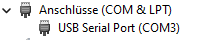
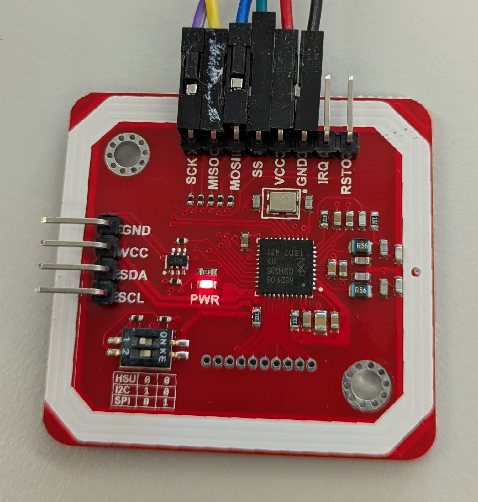

# carrera-bahn-stau-simulator

## Carerra Bahn D 132

Die Carrera Bahn ist eine Carrera Digital 132


Das hier ist die Unterseite:


Auto chassis:


Dieses 3D Modell soll als Grundlage dienen das Chassis anzupassen: [3D Modell](./assets/Podvozek_R03_v13.stl)

### Linksammlung

[Tuning](https://slotcar-3d.de/produkt/3d-tuningchassischassis-132-fuer-slotcar-carrera-bmw-m1-procar)

Car Slot Maintainance [YouTube Video](https://www.youtube.com/watch?v=z-db9KXGT7E)

Slot Cars Digital Carrera Chip 26732 [z.B. JaSpeed](https://www.jaspeed.com/Digitaldecoder-Carrera-132-Digital-Digitalchip-26732_3)

Motor E200 [z.B. JaSpeed](https://www.jaspeed.com/Motor-E200-Standard-Carrera-89200)

## Software zum Programmieren

### Git

Um unser Projekt von Github.com auf unseren Rechner zu *clonen* brauchen wir **git**.

Der Download ist hier:
https://git-scm.com/downloads

Hast Du **Git** installiert, so musst Du es noch konfigurieren.
Öffne dazu die *Git Bash* und tippe folgendes in die Konsole ein:

```bash
git config --global user.name "Dein Name"
git config --global user.email "deineMail@provider.com"
```

Damit haben wir **Git** konfiguriert und können weiter machen.

### Visual Studio Code 

**Visual Studio Code** ist die Entwicklungsumgebung (IDE).

Der Download ist hier:
https://code.visualstudio.com/

In der Entwicklungsumgebung gibt es eine Extension, die wir installieren: PlatformIO.
Auf der linken Seite von der Entwicklungsumgebung findet man *Extensions*, dort kann man PlatformIO suchen und installieren.

### CH340 Treiber für USB2Serial

Der ESP8266 D1 mini hat einen USB2Serial Chip verbaut. Dies ist normalerweise der CH340.
Für diesen Chip braucht man unter Windows einen Treiber, den man hier downloaden kann:

https://www.wemos.cc/en/latest/ch340_driver.html

Nach dem Download musst Du das Zip-Archiv entpacken und die *Setup.exe* starten.
Dann wird der Treiber für den Chip installiert.

Hast Du den ESP8266 D1 mini im PC eingesteckt, sollte im Gerätemanager so ein Eintrag erscheinen:



Ziehst Du den ESP8266 vom USB-Port ab, sollte der Eintrag verschwinden.

## Aufbau

Hier der Aufbau in einem Drawing von ExcalDraw:
<https://excalidraw.com/#room=24f6770fdbf78b3d32c7,81xEUfPUe7m3yJ3ZLXmCHA>

### Anschliessen de RFID-Readers an den ESP

Um den RFID-Reader PN532 an den ESP 8266 D1 mini anzuschliessen, müssen wir folgende Leitungen verbinden (Wir nehmen das SPI (Serial Peripheral Interface), das ist schneller als die I2C Schnittstelle):

```bash
---------------------
|PN532 | ESP8266    |
---------------------
|VCC   | 3.3V       |
|GND   | GND        |
|SCK   | D5 (GPIO14)|
|MISO  | D6 (GPIO12)|
|MOSI  | D7 (GPIO13)|
|SS    | D3 (GPIO00)|
---------------------

PN532 DIP-Schalter Einstellung:
Schalter 1: OFF
Schalter 2: ON (SPI-Modus)
```



## Einkaufsliste

RFID-Tags (20 Stück)
[https://funduinoshop.com/elektronische-module/wireless-iot/rfid-nfc/nfc-rfid-tag-mini-ntag213-oe-8mm](https://funduinoshop.com/elektronische-module/wireless-iot/rfid-nfc/nfc-rfid-tag-mini-ntag213-oe-8mm)

RFID-Reader (6 Stück)
[https://funduinoshop.com/en/electronic-modules/wireless-iot/rfid-nfc/pn532-nfc-rfid-v3-module-for-arduino-and-co.](https://funduinoshop.com/en/electronic-modules/wireless-iot/rfid-nfc/pn532-nfc-rfid-v3-module-for-arduino-and-co.)

Beschleunigungssensor (6 Stück)
[https://funduinoshop.com/en/electronic-modules/sensors/movement-distance/mpu-6050-module-triaxial-acceleration-sensor-gyroscope](https://funduinoshop.com/en/electronic-modules/sensors/movement-distance/mpu-6050-module-triaxial-acceleration-sensor-gyroscope)

ESP8266 mini (6 Stück)
[https://funduinoshop.com/en/electronic-modules/wireless-iot/esp-wifi/wemos-d1-mini-nodemcu-lua-wifi-esp8266-development-board](https://funduinoshop.com/en/electronic-modules/wireless-iot/esp-wifi/wemos-d1-mini-nodemcu-lua-wifi-esp8266-development-board)


## Todo

### Versuchsaufbau machen

- Tags an genauer Position festkleben
- ...


